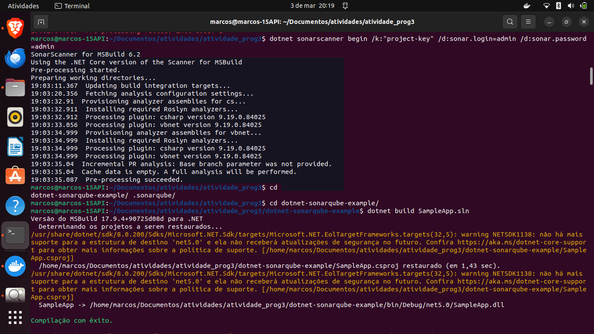
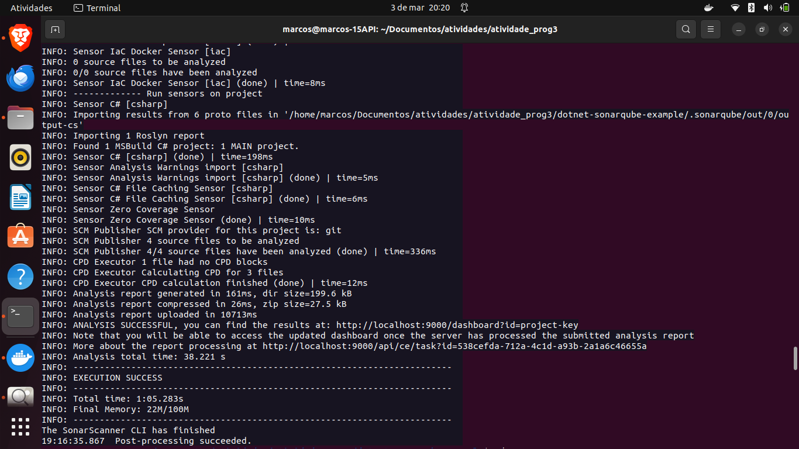
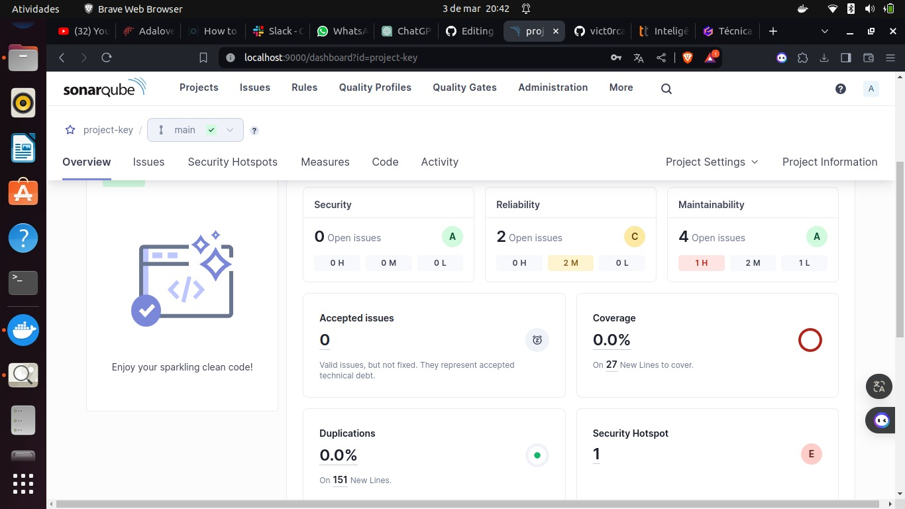

SonarScanner
=======
# Relatório: Configuração e Análise de Código com SonarQube, Docker e .NET Core

## Introdução
Neste relatório, descrevo o processo que segui para configurar e analisar o código utilizando SonarQube, Docker e .NET Core. Essas ferramentas são cruciais para garantir a qualidade e segurança do código em projetos de desenvolvimento de software.

## Tecnologias Utilizadas
- **SonarQube:** Uma ferramenta de análise de código que ajuda a identificar problemas de qualidade e segurança no código-fonte.
- **Docker:** Uma plataforma de virtualização de contêineres que simplifica a implantação e execução de aplicativos em diferentes ambientes.
- **.NET Core:** Um framework de desenvolvimento de software livre e de código aberto desenvolvido pela Microsoft para criar aplicativos para Windows, macOS e Linux.

## Passo a Passo
### 1. Configuração do Ambiente
- Instalei o Java SDK e configurei as variáveis de ambiente `PATH` e `JAVA_HOME`.
- Instalei o Docker para facilitar a execução do SonarQube em um contêiner.

### 2. Clonagem do Exemplo de Aplicativo .NET Core
- Clonei um exemplo de aplicativo .NET Core do GitHub utilizando o comando `git clone`.

### 3. Execução do SonarQube no Docker
- Iniciei um contêiner Docker com o SonarQube utilizando o comando `docker run`.
- Acessei o SonarQube pelo navegador e alterei a senha padrão.

### 4. Instalação e Configuração do SonarScanner para .NET Core
- Baixei o SonarScanner do GitHub e configurei as variáveis de ambiente `PATH`.
- Instalei o SonarScanner para .NET Core utilizando o comando `dotnet tool install`.

### 5. Análise de Código com o SonarScanner
- Iniciei a análise de código com o SonarScanner utilizando os comandos `dotnet sonarscanner begin`, `dotnet build` e `dotnet sonarscanner end`.

### 6. Visualização dos Resultados no SonarQube
- Acessei o SonarQube pelo navegador e visualizei os resultados da análise de código.
  
  

### 7. Personalização da Configuração do SonarQube (Opcional)
- Explorei as opções de personalização do SonarQube, como adicionar regras personalizadas ou excluir determinados arquivos da análise.

## Conclusão
Durante esta atividade, aprendi a configurar e analisar o código utilizando SonarQube, Docker e .NET Core. Com isso, compreendi a importância da qualidade e segurança do código em projetos de desenvolvimento de software. Além disso, pude perceber como ferramentas como o SonarQube podem auxiliar na identificação de problemas de código e na melhoria contínua da qualidade do software. Também aprendi a utilizar o Docker para facilitar a execução de aplicativos em diferentes ambientes e a integrar o SonarQube à minha pipeline de desenvolvimento.
